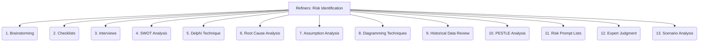

# Refiners: Project Management and Strategy - Risk Identification - 13-Fold Division

This document applies a 13-fold division to the 'Risk Identification' facet of 'Risk Assessment and Mitigation' under the 'Refiners' archetype, providing a deeper level of granularity for proactively discovering potential project risks.

## 1. Brainstorming

Group discussions and collaborative sessions to generate a comprehensive list of potential risks, encouraging diverse perspectives.

## 2. Checklists

Using predefined lists of common risks from similar projects, industries, or organizational standards to ensure systematic coverage.

## 3. Interviews

Gathering insights from experienced stakeholders, subject matter experts, and team members through structured or informal conversations.

## 4. SWOT Analysis

Identifying Strengths, Weaknesses, Opportunities, and Threats, where threats often represent potential risks to the project.

## 5. Delphi Technique

Anonymous expert opinions gathered through multiple rounds of questionnaires, used to identify and prioritize risks without group bias.

## 6. Root Cause Analysis

Investigating past incidents, problems, or near-misses to uncover underlying systemic risks that could lead to future issues.

## 7. Assumption Analysis

Examining project assumptions for potential invalidity, as false assumptions can become significant risks.

## 8. Diagramming Techniques

Using flowcharts, process maps, network diagrams, or cause-and-effect diagrams to visually identify potential risk points or failure modes.

## 9. Historical Data Review

Analyzing data from previous projects, industry benchmarks, or organizational databases for recurring risks and their patterns.

## 10. PESTLE Analysis

Examining Political, Economic, Social, Technological, Legal, and Environmental factors that could pose risks or opportunities to the project.

## 11. Risk Prompt Lists

Using structured questions or categories (e.g., technical, external, organizational, project management) to stimulate risk thinking and ensure comprehensive coverage.

## 12. Expert Judgment

Relying on the experience, intuition, and specialized knowledge of seasoned professionals to identify subtle or complex risks.

## 13. Scenario Analysis

Developing hypothetical future scenarios (e.g., best-case, worst-case, most likely) to uncover associated risks and their potential impacts.

---

## Visual Representation (Mermaid Diagram)

