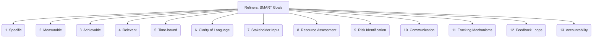

# Refiners: Project Management and Strategy - SMART Goals - 13-Fold Division

This document applies a 13-fold division to the 'SMART Goals' facet of 'Goal Definition and Alignment' under the 'Refiners' archetype, providing a deeper level of granularity for setting effective project objectives.

## 1. Specific (Who, What, Where, When, Why)

Clearly defined and unambiguous, leaving no room for misinterpretation about what needs to be achieved.

## 2. Measurable (How much, How many)

Quantifiable criteria for tracking progress and determining when the goal has been successfully met.

## 3. Achievable (Realistic, Attainable)

Goals that are challenging but possible to reach given the available resources, time, and capabilities.

## 4. Relevant (Meaningful, Aligned)

Goals that matter to the project, align with broader organizational objectives, and contribute to the overall vision.

## 5. Time-bound (Deadline, Frequency)

A defined timeframe for completion, including a start date and a target end date, creating a sense of urgency.

## 6. Clarity of Language

Using precise, concise, and understandable terms to articulate the goal, avoiding jargon or overly complex phrasing.

## 7. Stakeholder Input

Involving relevant parties (team members, clients, management) in the goal formulation process to ensure buy-in and shared understanding.

## 8. Resource Assessment

Evaluating the availability of necessary resources (e.g., budget, personnel, tools) to achieve the goal, and identifying any gaps.

## 9. Risk Identification

Anticipating potential obstacles, challenges, or dependencies that could hinder goal achievement, and planning mitigation strategies.

## 10. Communication

Clearly articulating SMART goals to all involved parties, ensuring everyone understands their role and the importance of the objective.

## 11. Tracking Mechanisms

Establishing tools, processes, or systems for monitoring progress towards the goal, providing regular updates and visibility.

## 12. Feedback Loops

Regularly reviewing progress, collecting feedback, and making necessary adjustments to the goal or the plan as new information emerges.

## 13. Accountability

Assigning clear responsibility for goal achievement to individuals or teams, fostering ownership and commitment.

---

## Visual Representation (Mermaid Diagram)

