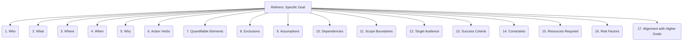

# Refiners: Project Management and Strategy - SMART Goals - Specific - 17-Fold Division

This document applies a 17-fold division to the 'Specific' facet of 'SMART Goals' under the 'Refiners' archetype, providing a deeper level of granularity for clearly defining project objectives.

## 1. Who

Identifying the individuals, teams, or departments responsible for achieving the goal, ensuring clear ownership.

## 2. What

Clearly defining the desired outcome, deliverable, or change that the goal aims to achieve, leaving no ambiguity.

## 3. Where

Specifying the location, context, or environment in which the goal will be achieved or where its impact will be felt.

## 4. When

Setting a precise timeframe, deadline, or frequency for completion, providing a clear temporal boundary.

## 5. Why

Explaining the purpose, benefits, or justification for the goal, connecting it to broader objectives and motivations.

## 6. Action Verbs

Using strong, unambiguous verbs to describe the action or change required, making the goal actionable.

## 7. Quantifiable Elements

Including numerical targets, percentages, or other measurable components where applicable, even if the primary focus is qualitative.

## 8. Exclusions

Clearly stating what is *not* part of the goal's scope, to prevent misunderstandings and scope creep.

## 9. Assumptions

Documenting any underlying assumptions that, if proven false, could impact the feasibility or success of the goal.

## 10. Dependencies

Identifying other tasks, conditions, or resources that the goal relies on for its successful achievement.

## 11. Scope Boundaries

Defining the precise limits and extent of the goal, preventing overreach or misdirection of effort.

## 12. Target Audience

Identifying who will benefit from or be impacted by the achievement of the goal, guiding its design and communication.

## 13. Success Criteria

Explicitly stating how success will be measured and recognized, providing clear benchmarks for evaluation.

## 14. Constraints

Any limitations, restrictions, or external factors that might affect the achievement of the goal (e.g., budget, technology, regulations).

## 15. Resources Required

Listing the necessary personnel, tools, budget, or other assets needed to achieve the goal.

## 16. Risk Factors

Potential issues, challenges, or uncertainties that could prevent or hinder the achievement of the goal.

## 17. Alignment with Higher Goals

How this specific goal contributes directly to broader strategic objectives or the overall project vision.

---

## Visual Representation (Mermaid Diagram)

