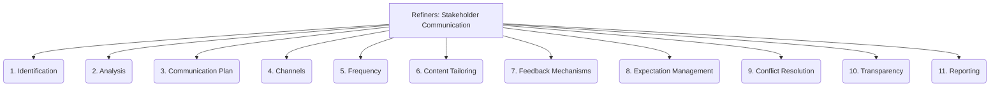

# Refiners: Project Management and Strategy - Stakeholder Communication - 11-Fold Division

This document applies an 11-fold division to the 'Stakeholder Communication' facet of 'Project Management and Strategy' under the 'Refiners' archetype, providing a deeper level of granularity for effectively engaging and informing all parties involved in the project.

## 1. Identification

Identifying all relevant stakeholders (e.g., clients, users, team members, management, regulators, suppliers) who are impacted by or interested in the project.

## 2. Analysis

Understanding each stakeholder's interests, influence, expectations, and communication needs and preferences.

## 3. Communication Plan

Developing a strategic plan outlining how, when, what, and by whom information will be communicated to each stakeholder group.

## 4. Channels

Selecting appropriate communication channels (e.g., formal meetings, email, instant messaging, reports, dashboards, presentations) based on the message and audience.

## 5. Frequency

Determining how often communication will occur for each stakeholder group, balancing the need for information with avoiding overload.

## 6. Content Tailoring

Adapting the message, level of detail, and language to suit the specific needs, interests, and technical understanding of different audiences.

## 7. Feedback Mechanisms

Establishing ways for stakeholders to provide input, ask questions, raise concerns, and offer suggestions, ensuring two-way communication.

## 8. Expectation Management

Clearly setting and managing stakeholder expectations regarding project scope, timelines, deliverables, and potential challenges.

## 9. Conflict Resolution

Addressing disagreements, misunderstandings, or competing interests among stakeholders through effective communication and negotiation.

## 10. Transparency

Being open and honest about project status, challenges, risks, and decisions, fostering trust and credibility.

## 11. Reporting

Providing regular, structured updates on project progress, performance, budget, and key milestones to relevant stakeholders.

---

## Visual Representation (Mermaid Diagram)

