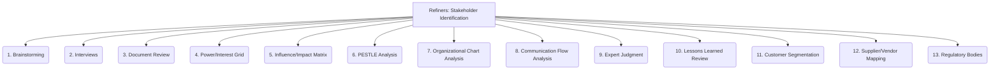

# Refiners: Project Management and Strategy - Stakeholder Identification - 13-Fold Division

This document applies a 13-fold division to the 'Identification' facet of 'Stakeholder Communication' under the 'Refiners' archetype, providing a deeper level of granularity for recognizing all relevant stakeholders.

## 1. Brainstorming

Group discussions and collaborative sessions to generate a comprehensive list of all potential stakeholders, encouraging diverse perspectives.

## 2. Interviews

Gathering insights from existing team members, clients, domain experts, and other key individuals to identify stakeholders.

## 3. Document Review

Analyzing project charters, contracts, organizational charts, previous project records, and other relevant documents for stakeholder mentions.

## 4. Power/Interest Grid

Mapping stakeholders based on their level of power (ability to influence) and interest (level of concern) in the project.

## 5. Influence/Impact Matrix

Assessing how much influence stakeholders have on the project and how much they are impacted by the project's outcomes.

## 6. PESTLE Analysis

Considering Political, Economic, Social, Technological, Legal, and Environmental factors to identify external stakeholders who might affect the project.

## 7. Organizational Chart Analysis

Identifying formal roles, reporting structures, and departments within the organization that are relevant to the project.

## 8. Communication Flow Analysis

Tracing existing communication paths and information flows within the organization to identify key individuals and groups involved.

## 9. Expert Judgment

Relying on the experience, knowledge, and intuition of seasoned project managers, leaders, or consultants to identify stakeholders.

## 10. Lessons Learned Review

Examining retrospectives and lessons learned from previous projects to identify stakeholders who might have been overlooked.

## 11. Customer Segmentation

Identifying different groups of end-users or customers who will be affected by or benefit from the project.

## 12. Supplier/Vendor Mapping

Identifying external partners, suppliers, or vendors who provide resources or services critical to the project.

## 13. Regulatory Bodies

Identifying government agencies, industry associations, or other regulatory bodies with oversight or compliance requirements related to the project.

---

## Visual Representation (Mermaid Diagram)

