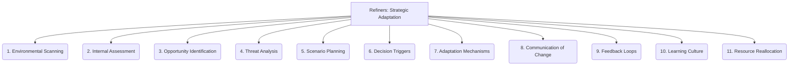

# Refiners: Project Management and Strategy - Strategic Adaptation - 11-Fold Division

This document applies an 11-fold division to the 'Strategic Adaptation' facet of 'Project Management and Strategy' under the 'Refiners' archetype, providing a deeper level of granularity for how projects adjust to changing circumstances.

## 1. Environmental Scanning

Continuously monitoring external factors such as market trends, technological advancements, regulatory changes, and competitive landscapes for potential impacts.

## 2. Internal Assessment

Evaluating the project's current capabilities, resources, performance, and internal strengths and weaknesses to understand its adaptive capacity.

## 3. Opportunity Identification

Recognizing new possibilities, emerging trends, or unmet needs that the project can leverage for growth or improved outcomes.

## 4. Threat Analysis

Identifying potential risks, challenges, or adverse conditions that could jeopardize the project's success or long-term viability.

## 5. Scenario Planning

Developing multiple plausible future scenarios and outlining potential responses or strategies for each, preparing for various eventualities.

## 6. Decision Triggers

Defining clear conditions, thresholds, or events that necessitate a formal strategic review or a decision to adapt the project's direction.

## 7. Adaptation Mechanisms

Establishing processes, tools, and organizational structures that facilitate the adjustment of plans, goals, approaches, or resource allocation.

## 8. Communication of Change

Effectively conveying strategic shifts, their rationale, and their implications to all stakeholders, ensuring understanding and buy-in.

## 9. Feedback Loops

Collecting information on the effectiveness of implemented adaptations, analyzing results, and making further adjustments based on lessons learned.

## 10. Learning Culture

Fostering an environment where the project team and organization learn from successes and failures, promoting continuous improvement and knowledge sharing.

## 11. Resource Reallocation

Shifting financial, human, and technological resources to support new strategic directions, priorities, or adapted plans.

---

## Visual Representation (Mermaid Diagram)

