# Refiners: Project Management and Strategy - Technological Advancements - 17-Fold Division

This document applies a 17-fold division to the 'Technological Advancements' facet of 'Environmental Scanning' under the 'Refiners' archetype, providing a deeper level of granularity for monitoring technological evolution.

## 1. Emerging Technologies

Identifying nascent technologies with the potential for significant future impact, often in early research or prototype stages.

## 2. Disruptive Innovations

Recognizing technologies that could fundamentally change existing markets, industries, or operational paradigms, creating new opportunities or threats.

## 3. Platform Shifts

Tracking changes in dominant computing platforms, operating systems, or foundational software environments (e.g., cloud, mobile, edge, quantum).

## 4. Tooling Ecosystem Evolution

Monitoring the emergence of new development tools, frameworks, libraries, and integrated development environments (IDEs).

## 5. Algorithm Breakthroughs

Keeping up with significant advances in artificial intelligence, machine learning, optimization algorithms, and other computational methods.

## 6. Hardware Innovations

Tracking developments in processors (CPUs, GPUs, NPUs), sensors, specialized computing units, and new materials science.

## 7. Connectivity and Networking

Monitoring advancements in communication technologies, network protocols, and infrastructure (e.g., 5G, IoT, satellite internet, mesh networks).

## 8. Data Storage and Processing

Tracking new methods for storing, managing, analyzing, and securing large and complex datasets, including databases and distributed systems.

## 9. Security Technologies

Monitoring new approaches, tools, and methodologies for cybersecurity, data protection, privacy, and threat detection.

## 10. Open Source Contributions

Identifying significant new open-source projects, major updates to existing ones, and trends in collaborative software development.

## 11. Research and Development Trends

Following academic and industrial research and development efforts, including publications, grants, and corporate investments in new technologies.

## 12. Patent and IP Landscape

Analyzing new patents, intellectual property developments, and licensing trends that could impact technological adoption or competition.

## 13. Talent Pool Availability

Assessing the presence, growth, and accessibility of skilled professionals and expertise required for new technologies.

## 14. Vendor Roadmaps

Understanding the future plans, product releases, and strategic directions of key technology providers and industry leaders.

## 15. Standardization Efforts

Tracking the development and adoption of new technical standards, protocols, and interoperability specifications.

## 16. Ethical Implications

Considering the societal, moral, and ethical impacts of new technologies, including issues of bias, fairness, and accountability.

## 17. Adoption Rates and Maturity

Evaluating how quickly new technologies are being adopted across industries and their level of stability, reliability, and readiness for widespread use.

---

## Visual Representation (Mermaid Diagram)

```mermaid
graph TD
    A[Refiners: Technological Advancements] --> B(1. Emerging Technologies)
    A --> C(2. Disruptive Innovations)
    A --> D(3. Platform Shifts)
    A --> E(4. Tooling Ecosystem Evolution)
    A --> F(5. Algorithm Breakthroughs)
    A --> G(6. Hardware Innovations)
    A --> H(7. Connectivity and Networking)
    A --> I(8. Data Storage and Processing)
    A --> J(9. Security Technologies)
    A --> K(10. Open Source Contributions)
    A --> L(11. Research and Development Trends)
    A --> M(12. Patent and IP Landscape)
    A --> N(13. Talent Pool Availability)
    A --> O(14. Vendor Roadmaps)
    A --> P(15. Standardization Efforts)
    A --> Q(16. Ethical Implications)
    A --> R(17. Adoption Rates and Maturity)
```

