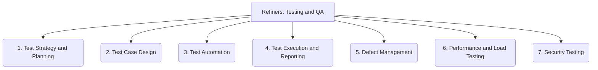

# Refiners: Testing and QA - 7-Fold Division

This document applies the 7-fold division of the Heptad to the 'Testing and QA' thematic group under the 'Refiners' archetype, providing a deeper level of granularity for ensuring the quality and reliability of the system.

## 1. Test Strategy and Planning

Defining the overall approach, scope, objectives, and resources for testing activities, aligning with project goals and risk assessment.

## 2. Test Case Design

Creating effective and comprehensive test cases that cover various scenarios, requirements, and edge cases to validate system functionality.

## 3. Test Automation

Implementing automated tests (unit, integration, end-to-end) to improve efficiency, repeatability, and speed of feedback in the development cycle.

## 4. Test Execution and Reporting

Running tests, collecting results, analyzing failures, and communicating findings to relevant stakeholders in a clear and actionable manner.

## 5. Defect Management

Identifying, tracking, prioritizing, reproducing, and resolving bugs, errors, and other issues found during testing.

## 6. Performance and Load Testing

Assessing system behavior, responsiveness, and stability under various stress conditions, including high user loads and data volumes.

## 7. Security Testing

Evaluating the system's resilience against potential vulnerabilities, threats, and attacks, ensuring data protection and system integrity.

---

## Visual Representation (Mermaid Diagram)

