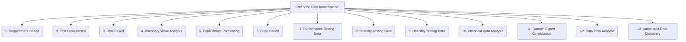

# Refiners: Testing and QA - Data Identification - 13-Fold Division

This document applies a 13-fold division to the 'Data Identification' facet of 'Test Data Management' under the 'Refiners' archetype, providing a deeper level of granularity for determining what data is needed for testing.

## 1. Requirement-Based

Deriving data needs directly from functional and non-functional requirements, ensuring that all specified behaviors are testable.

## 2. Test Case-Based

Identifying specific data required for individual test cases, ensuring each test has the precise inputs it needs to execute.

## 3. Risk-Based

Focusing on data needed to test high-risk areas of the application, critical functionalities, or components with a history of defects.

## 4. Boundary Value Analysis

Identifying data at the limits of valid input ranges (e.g., minimum, maximum, just inside/outside boundaries) to test system robustness.

## 5. Equivalence Partitioning

Selecting representative data from valid and invalid input classes, reducing the number of test cases while maintaining coverage.

## 6. State-Based

Data needed to test different states of the application or system, ensuring transitions and behaviors across states are correct.

## 7. Performance Testing Data

Large volumes, specific patterns, or realistic distributions of data required to simulate load, stress, or endurance conditions.

## 8. Security Testing Data

Data specifically designed to expose vulnerabilities, such as malicious inputs, SQL injection strings, or cross-site scripting payloads.

## 9. Usability Testing Data

Realistic data that reflects typical user scenarios and workflows, used to evaluate the user experience.

## 10. Historical Data Analysis

Analyzing past production data or logs to identify common patterns, frequent transactions, or unusual edge cases that should be tested.

## 11. Domain Expert Consultation

Gathering data requirements and insights from subject matter experts who have deep knowledge of the business domain and data nuances.

## 12. Data Flow Analysis

Tracing data through the system from input to output to identify all necessary inputs, intermediate data, and expected results.

## 13. Automated Data Discovery

Using tools or algorithms to scan applications, databases, or existing test suites to automatically identify and suggest data patterns or requirements.

---

## Visual Representation (Mermaid Diagram)

