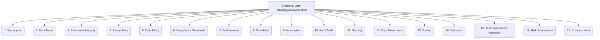

# Refiners: Testing and QA - Data Masking/Anonymization - 17-Fold Division

This document applies a 17-fold division to the 'Data Masking/Anonymization' facet of 'Test Data Management' under the 'Refiners' archetype, providing a deeper level of granularity for protecting sensitive data in test environments.

## 1. Techniques

Specific methods used for masking or anonymizing data, such as substitution, shuffling, encryption, tokenization, or nulling out.

## 2. Data Types

Specific handling and masking rules for different data types, including names, addresses, financial data, dates, and unique identifiers.

## 3. Referential Integrity

Maintaining consistent relationships between masked data across different tables, databases, or systems to ensure data usability for testing.

## 4. Reversibility

Whether the masking process is irreversible (anonymization) or can be undone (pseudonymization) for specific purposes under strict controls.

## 5. Data Utility

Ensuring that the masked or anonymized data remains realistic, representative, and useful for its intended testing purposes without compromising privacy.

## 6. Compliance Standards

Adhering to relevant data privacy regulations (e.g., GDPR, HIPAA, CCPA) and internal organizational policies regarding sensitive data handling.

## 7. Performance

The speed and efficiency of the data masking process, especially when dealing with large volumes of data or complex masking rules.

## 8. Scalability

The ability of the masking solution to handle increasing volumes and complexity of data, and to scale across distributed systems.

## 9. Automation

Automating the data masking process within CI/CD pipelines or data provisioning workflows to ensure consistent and timely application.

## 10. Audit Trails

Logging and tracking all data masking operations, including who performed them, when, and what data was affected, for compliance and debugging.

## 11. Security

Protecting the masking keys, algorithms, and the masking process itself from unauthorized access or tampering.

## 12. Data Governance

Policies, procedures, and roles defining how masked data is managed, accessed, and used throughout its lifecycle.

## 13. Tooling

Specialized software, platforms, or custom scripts used to perform data masking and anonymization operations.

## 14. Validation

Verifying that the masking has been applied correctly, effectively, and that the masked data meets the required utility and privacy standards.

## 15. Test Environment Integration

How masked data is provisioned, refreshed, and managed within various test environments (e.g., development, QA, staging).

## 16. Risk Assessment

Identifying potential risks associated with data masking, such as re-identification risks, data corruption, or impact on test coverage.

## 17. Customization

The ability to define and implement custom masking rules, algorithms, or logic to address specific business requirements or complex data relationships.

---

## Visual Representation (Mermaid Diagram)

