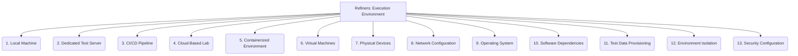

# Refiners: Testing and QA - Execution Environment - 13-Fold Division

This document applies a 13-fold division to the 'Execution Environment' facet of 'Test Execution and Reporting' under the 'Refiners' archetype, providing a deeper level of granularity for where tests are run.

## 1. Local Machine

Running tests directly on a developer's workstation, providing immediate feedback during development.

## 2. Dedicated Test Server

A physical or virtual machine specifically allocated and configured for running tests, often for more stable or resource-intensive test suites.

## 3. CI/CD Pipeline

Automated execution of tests as an integral part of the continuous integration and continuous delivery workflow, triggered by code changes.

## 4. Cloud-Based Lab

Utilizing cloud services (e.g., AWS Device Farm, Sauce Labs, BrowserStack) for on-demand test environments, often for diverse device or browser testing.

## 5. Containerized Environment

Running tests within isolated, lightweight containers (e.g., Docker, Kubernetes pods) to ensure consistent and reproducible test conditions.

## 6. Virtual Machines

Using virtual machines to create consistent and reproducible test environments, allowing for different operating systems or configurations.

## 7. Physical Devices

Testing on actual hardware (e.g., mobile phones, tablets, IoT devices, specialized embedded systems) for realistic performance and compatibility.

## 8. Network Configuration

Specifying network conditions within the test environment, such as latency, bandwidth, firewall rules, or proxy settings.

## 9. Operating System

The specific operating system (e.g., Windows, Linux distribution, macOS, Android, iOS) and its version used for testing.

## 10. Software Dependencies

Ensuring all required libraries, runtimes, databases, and other software components are present and correctly configured in the environment.

## 11. Test Data Provisioning

How test data is made available to the environment, including database seeding, file uploads, or API calls.

## 12. Environment Isolation

Ensuring test environments are independent and do not interfere with each other, preventing test pollution and ensuring reliable results.

## 13. Security Configuration

Setting up appropriate security measures within the test environment, including access controls, network segmentation, and data protection.

---

## Visual Representation (Mermaid Diagram)

