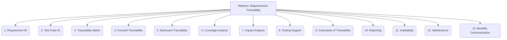

# Refiners: Testing and QA - Requirements Traceability - 13-Fold Division

This document applies a 13-fold division to the 'Requirements Traceability' facet of 'Test Case Design' under the 'Refiners' archetype, providing a deeper level of granularity for linking test cases directly to specific requirements.

## 1. Requirement ID

Unique identifier assigned to each requirement, serving as a primary reference point.

## 2. Test Case ID

Unique identifier assigned to each test case, allowing for precise linking to requirements.

## 3. Traceability Matrix

A document or tool (e.g., spreadsheet, dedicated software) that systematically links requirements to test cases, design elements, and code.

## 4. Forward Traceability

Linking requirements to subsequent development artifacts, such as design specifications, code modules, and test cases, to ensure all requirements are implemented.

## 5. Backward Traceability

Linking tests, code, and design elements back to their originating requirements, to understand the purpose of each artifact.

## 6. Coverage Analysis

Measuring the percentage or extent to which requirements are covered by test cases, identifying gaps in testing.

## 7. Impact Analysis

Assessing the potential effects of a requirement change on existing test cases, design, and code, and vice versa.

## 8. Tooling Support

Software tools (e.g., ALM tools, requirements management systems) that facilitate the creation, maintenance, and reporting of traceability links.

## 9. Granularity of Traceability

The level of detail at which traceability is maintained (e.g., linking a high-level requirement to a test suite, or a detailed sub-requirement to a specific test step).

## 10. Reporting

Generating reports on traceability status, coverage gaps, and the impact of changes to inform stakeholders and decision-making.

## 11. Auditability

Ensuring that traceability links are clear, verifiable, and can be easily audited for compliance with standards or regulations.

## 12. Maintenance

Processes and practices for keeping traceability links up-to-date as requirements, design, and tests evolve throughout the project lifecycle.

## 13. Benefits Communication

Articulating the value and importance of maintaining traceability to stakeholders, highlighting its role in quality, risk management, and compliance.

---

## Visual Representation (Mermaid Diagram)

