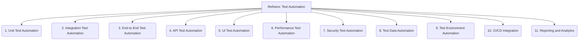

# Refiners: Testing and QA - Test Automation - 11-Fold Division

This document applies an 11-fold division to the 'Test Automation' facet of 'Testing and QA' under the 'Refiners' archetype, providing a deeper level of granularity for automating testing processes.

## 1. Unit Test Automation

Automating tests for individual code components, functions, or methods in isolation to verify their correctness.

## 2. Integration Test Automation

Automating tests for interactions and interfaces between different modules, services, or subsystems to ensure they work together correctly.

## 3. End-to-End Test Automation

Automating tests that simulate real user scenarios across the entire system, from user interface to backend services, to validate complete workflows.

## 4. API Test Automation

Automating tests for REST, SOAP, GraphQL, or other API endpoints to verify their functionality, performance, and security.

## 5. UI Test Automation

Automating tests for graphical user interfaces (GUIs) to ensure visual correctness, responsiveness, and user interaction flows.

## 6. Performance Test Automation

Automating load, stress, scalability, and endurance tests to assess system behavior under various performance conditions.

## 7. Security Test Automation

Automating vulnerability scanning, penetration testing, and other security checks to identify and mitigate security flaws.

## 8. Test Data Automation

Automating the generation, provisioning, masking, and cleanup of test data required for various testing scenarios.

## 9. Test Environment Automation

Automating the setup, configuration, and teardown of test environments, ensuring consistency and reproducibility.

## 10. CI/CD Integration

Integrating automated tests into continuous integration and continuous delivery pipelines to provide rapid feedback on code changes.

## 11. Reporting and Analytics

Automating the collection, analysis, visualization, and reporting of test results, metrics, and trends to provide insights into quality.

---

## Visual Representation (Mermaid Diagram)

