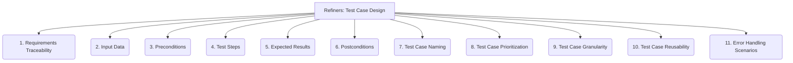

# Refiners: Testing and QA - Test Case Design - 11-Fold Division

This document applies an 11-fold division to the 'Test Case Design' facet of 'Testing and QA' under the 'Refiners' archetype, providing a deeper level of granularity for creating effective test cases.

## 1. Requirements Traceability

Linking test cases directly to specific functional or non-functional requirements, ensuring comprehensive test coverage.

## 2. Input Data

Defining the specific data to be used for each test case, including valid, invalid, and boundary values.

## 3. Preconditions

Specifying the necessary state of the system, environment, or data that must exist before the test case can be executed.

## 4. Test Steps

A clear, sequential, and unambiguous list of actions or operations to perform during the execution of the test case.

## 5. Expected Results

The anticipated outcome or behavior of each test step or the entire test case, serving as the basis for pass/fail determination.

## 6. Postconditions

The expected state of the system, environment, or data after the successful execution of the test case.

## 7. Test Case Naming

Establishing clear, consistent, and descriptive naming conventions for test cases to facilitate organization and understanding.

## 8. Test Case Prioritization

Assigning importance levels to test cases based on risk, business impact, frequency of use, or criticality of functionality.

## 9. Test Case Granularity

Deciding the level of detail for each test case, balancing comprehensiveness with maintainability and execution time.

## 10. Test Case Reusability

Designing test cases that can be reused across different test cycles, product versions, or even different projects, reducing duplication of effort.

## 11. Error Handling Scenarios

Designing test cases specifically to validate how the system handles invalid inputs, unexpected conditions, or error situations.

---

## Visual Representation (Mermaid Diagram)

