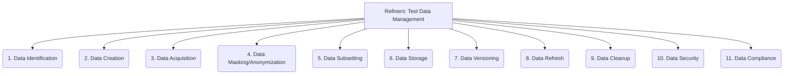

# Refiners: Testing and QA - Test Data Management - 11-Fold Division

This document applies an 11-fold division to the 'Test Data Management' facet of 'Testing and QA' under the 'Refiners' archetype, providing a deeper level of granularity for how test data is created, managed, and maintained.

## 1. Data Identification

Determining what specific data is needed for testing, based on test cases, requirements, and risk assessment.

## 2. Data Creation

Generating new test data, either synthetically, through data generation tools, or by manual input, to cover specific scenarios.

## 3. Data Acquisition

Obtaining existing data from production systems, external sources, or other test environments, often requiring extraction and transformation.

## 4. Data Masking/Anonymization

Protecting sensitive or confidential data by masking, anonymizing, or pseudonymizing it for use in non-production test environments.

## 5. Data Subsetting

Creating smaller, representative datasets from larger volumes of data to enable more efficient and focused testing.

## 6. Data Storage

Choosing and implementing appropriate storage solutions for test data, considering factors like volume, access speed, and security.

## 7. Data Versioning

Managing different versions or states of test data, allowing for reproducible tests and tracking changes over time.

## 8. Data Refresh

Mechanisms for updating or refreshing test data to reflect changes in the system under test or to reset the test environment to a known state.

## 9. Data Cleanup

Processes for removing or archiving test data after testing is complete, to maintain data hygiene and free up storage resources.

## 10. Data Security

Implementing measures to protect test data from unauthorized access, modification, or misuse, especially for sensitive information.

## 11. Data Compliance

Ensuring that test data creation, storage, and usage adhere to relevant data privacy regulations (e.g., GDPR, HIPAA) and internal policies.

---

## Visual Representation (Mermaid Diagram)

