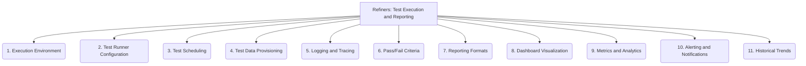

# Refiners: Testing and QA - Test Execution and Reporting - 11-Fold Division

This document applies an 11-fold division to the 'Test Execution and Reporting' facet of 'Testing and QA' under the 'Refiners' archetype, providing a deeper level of granularity for running tests and communicating their outcomes.

## 1. Execution Environment

Where tests are run (e.g., local developer machine, dedicated test server, CI/CD pipeline, cloud-based test lab, containerized environment).

## 2. Test Runner Configuration

Setting up the test runner with specific parameters, such as test selection, parallelism, retry mechanisms, and output verbosity.

## 3. Test Scheduling

Planning when and how often tests are executed (e.g., on every commit, nightly, weekly, on demand, triggered by specific events).

## 4. Test Data Provisioning

Ensuring the right test data is available, correctly configured, and isolated for each test run, often involving setup and teardown scripts.

## 5. Logging and Tracing

Capturing detailed information during test runs, including test steps, system logs, network traffic, and application state, for debugging and analysis.

## 6. Pass/Fail Criteria

Defining what constitutes a successful or failed test, including expected outcomes, error thresholds, and performance benchmarks.

## 7. Reporting Formats

Generating test results in various formats (e.g., JUnit XML, HTML, JSON, plain text) for different audiences and integration with other tools.

## 8. Dashboard Visualization

Presenting test results in an easily digestible visual format, such as dashboards, charts, and graphs, to provide quick insights into quality status.

## 9. Metrics and Analytics

Tracking key performance indicators (e.g., pass rate, execution time, defect density, test coverage) to assess testing effectiveness and project health.

## 10. Alerting and Notifications

Configuring automated alerts and notifications (e.g., email, Slack, PagerDuty) for test failures, critical issues, or significant changes in test trends.

## 11. Historical Trends

Analyzing test results over time to identify patterns, regressions, improvements, or areas of concern in the project's quality.

---

## Visual Representation (Mermaid Diagram)

