# Refiners: Testing and QA - Test Frameworks - 17-Fold Division

This document applies a 17-fold division to the 'Test Frameworks' facet of 'Unit Test Automation' under the 'Refiners' archetype, providing a deeper level of granularity for choosing and configuring testing frameworks.

## 1. Language Support

Compatibility and native support for specific programming languages (e.g., Java, Python, JavaScript, Go, Rust, C#).

## 2. Assertion Libraries

Built-in or integrated libraries for making assertions about test outcomes, verifying expected behaviors, and reporting failures.

## 3. Test Runners

Mechanisms for discovering, executing, and reporting on tests, often providing command-line interfaces or graphical user interfaces.

## 4. Test Fixtures/Setup

Features for setting up and tearing down test environments, test data, or preconditions before and after test execution.

## 5. Test Doubles Support

Built-in capabilities or integrations for creating mocks, stubs, fakes, or spies to isolate units under test and control dependencies.

## 6. Parameterization

Running the same test logic with different sets of input data, reducing code duplication and increasing test coverage.

## 7. Test Grouping/Tagging

Organizing tests into logical groups, categories, or tags for selective execution, parallelization, or reporting.

## 8. Reporting Formats

Outputting test results in various formats (e.g., JUnit XML, HTML, console, JSON) for integration with other tools or human readability.

## 9. IDE Integration

Seamless integration with popular Integrated Development Environments (IDEs), providing features like test execution from the IDE, debugging, and code navigation.

## 10. CI/CD Integration

Ease of integration with continuous integration and continuous delivery pipelines, allowing automated test execution on every code change.

## 11. Extensibility

Ability to extend the framework with custom assertions, test runners, plugins, or integrations with other testing tools.

## 12. Performance

The speed and efficiency of test execution, impacting developer feedback cycles and CI/CD pipeline duration.

## 13. Community Support

Availability of comprehensive documentation, tutorials, active community forums, and third-party plugins or extensions.

## 14. Maturity and Stability

The framework's age, reliability, active development, and track record of stable releases.

## 15. Learning Curve

How easy it is for new users to learn, adopt, and become proficient with the framework, including its concepts and API.

## 16. Parallel Execution

Capabilities for running multiple tests concurrently across different threads, processes, or machines to speed up execution time.

## 17. Snapshot Testing

Comparing rendered UI components, data structures, or output against stored snapshots to detect unintended changes, often used for UI or data consistency.

---

## Visual Representation (Mermaid Diagram)

```mermaid
graph TD
    A[Refiners: Test Frameworks] --> B(1. Language Support)
    A --> C(2. Assertion Libraries)
    A --> D(3. Test Runners)
    A --> E(4. Test Fixtures/Setup)
    A --> F(5. Test Doubles Support)
    A --> G(6. Parameterization)
    A --> H(7. Test Grouping/Tagging)
    A --> I(8. Reporting Formats)
    A --> J(9. IDE Integration)
    A --> K(10. CI/CD Integration)
    A --> L(11. Extensibility)
    A --> M(12. Performance)
    A --> N(13. Community Support)
    A --> O(14. Maturity and Stability)
    A --> P(15. Learning Curve)
    A --> Q(16. Parallel Execution)
    A --> R(17. Snapshot Testing)
```

