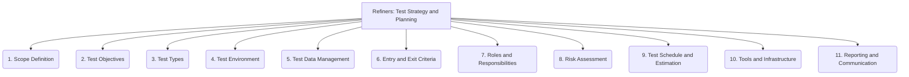

# Refiners: Testing and QA - Test Strategy and Planning - 11-Fold Division

This document applies an 11-fold division to the 'Test Strategy and Planning' facet of 'Testing and QA' under the 'Refiners' archetype, providing a deeper level of granularity for defining the approach and objectives of testing efforts.

## 1. Scope Definition

Clearly defining what will and will not be tested, including the boundaries of the system under test and specific functionalities.

## 2. Test Objectives

Stating the specific goals and purposes of the testing effort, such as finding defects, verifying requirements, or assessing quality attributes.

## 3. Test Types

Identifying the different kinds of testing to be performed (e.g., unit, integration, system, performance, security, usability) based on project needs.

## 4. Test Environment

Specifying the necessary hardware, software, network configurations, and data required to execute tests effectively.

## 5. Test Data Management

Strategies and processes for creating, managing, maintaining, and securing test data, ensuring its relevance and integrity.

## 6. Entry and Exit Criteria

Defining the conditions that must be met to start (entry) and stop (exit) specific testing activities or phases.

## 7. Roles and Responsibilities

Assigning clear roles, duties, and accountability to team members involved in the planning, execution, and reporting of testing activities.

## 8. Risk Assessment

Identifying potential risks to the project (e.g., technical, business, schedule) and how testing will be designed to mitigate them.

## 9. Test Schedule and Estimation

Planning the timeline for testing activities, estimating the effort required, and allocating resources accordingly.

## 10. Tools and Infrastructure

Selecting and configuring the necessary testing tools, frameworks, automation platforms, and underlying infrastructure.

## 11. Reporting and Communication

How test progress, results, issues, and overall quality status will be communicated to stakeholders, ensuring transparency and informed decision-making.

---

## Visual Representation (Mermaid Diagram)

