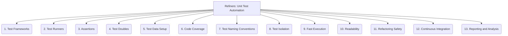

# Refiners: Testing and QA - Unit Test Automation - 13-Fold Division

This document applies a 13-fold division to the 'Unit Test Automation' facet of 'Test Automation' under the 'Refiners' archetype, providing a deeper level of granularity for automating tests for individual code components.

## 1. Test Frameworks

Choosing and configuring appropriate testing frameworks (e.g., JUnit, NUnit, Pytest, Jest, Go test) for the programming language and project.

## 2. Test Runners

Tools or built-in functionalities for executing unit tests and reporting their outcomes, often integrated with IDEs or build systems.

## 3. Assertions

Methods or functions used within tests to verify expected outcomes, conditions, or states of the unit under test.

## 4. Test Doubles

Using mocks, stubs, fakes, or spies to isolate the unit under test from its dependencies, ensuring focused testing.

## 5. Test Data Setup

Preparing specific input data, initial states, or environmental conditions required for individual unit tests to execute correctly.

## 6. Code Coverage

Measuring the percentage of code (lines, branches, functions) exercised by unit tests, indicating the thoroughness of testing.

## 7. Test Naming Conventions

Establishing clear and consistent names for unit tests that describe their purpose, the unit being tested, and the expected behavior.

## 8. Test Isolation

Ensuring that unit tests run independently of each other, so the failure or success of one test does not affect others.

## 9. Fast Execution

Designing tests to run quickly, providing rapid feedback to developers during the development cycle.

## 10. Readability

Writing tests that are easy to understand, maintain, and debug, often following a Given-When-Then structure.

## 11. Refactoring Safety

Using a comprehensive suite of unit tests to ensure that code changes or refactorings do not inadvertently break existing functionality.

## 12. Continuous Integration

Integrating unit tests into the CI pipeline for automated execution on every code change, providing immediate feedback on regressions.

## 13. Reporting and Analysis

Generating reports on unit test results, identifying trends, and analyzing failures to improve code quality and testing effectiveness.

---

## Visual Representation (Mermaid Diagram)

