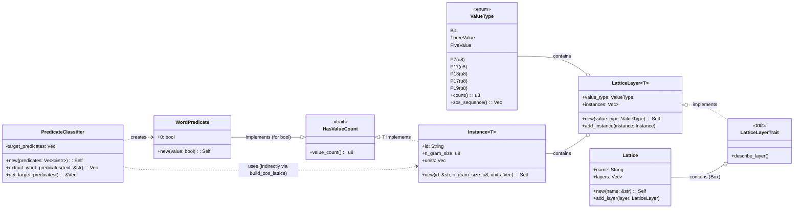

### C4 System Context Diagram

This diagram shows the Meta-Introspector Project as a whole, and its interactions with external users and systems.

```mermaid
graph TD
    A[Developer] -->|Uses| B(Meta-Introspector Project)
    C[AI Agent] -->|Interacts with| B
    B -->|Reads from| D[Git Repository]
    B -->|Processes| E[Markdown Files (CRQ, SOP)]
    B -->|Uses| F[Cargo/Rust Toolchain]

    subgraph Meta-Introspector Project
        B
    end
```

### C4 Container Diagram

This diagram zooms into the Meta-Introspector Project and shows the main applications/services (containers) within it, and their interactions.

```mermaid
graph TD
    subgraph Meta-Introspector Project
        subgraph Rust Applications
            subgraph submodules (Rust Library)
                L[CRQ Parser Module]
                M[Predicate Classifier Module]
            end
            C1[crq-parser-cli (Rust CLI)]
            C2[state-word-reporter (Rust CLI)]
        end
        G[Git (External Tool)]
        H[Cargo (External Tool)]
        I[Markdown Files (CRQ, SOP)]
    end

    C1 -->|Uses| L
    C2 -->|Uses| M
    C1 -->|Reads| I
    C2 -->|Reads| I
    C1 -->|Built by| H
    C2 -->|Built by| H
    H -->|Manages| G
```

### UML Class Diagram for Lattice Model

This diagram illustrates the key structs and traits involved in the lattice model, along with their relationships and important fields/methods.

